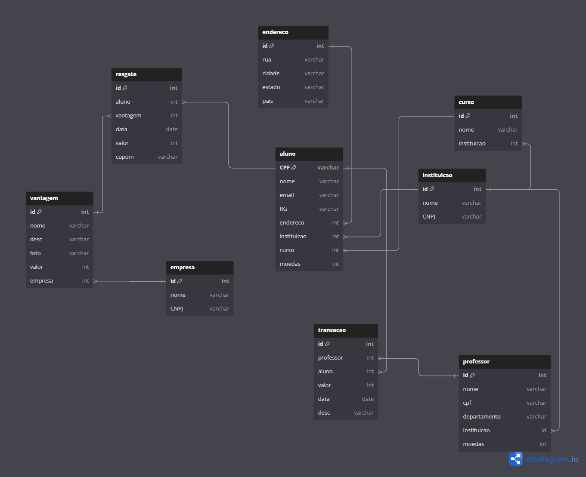
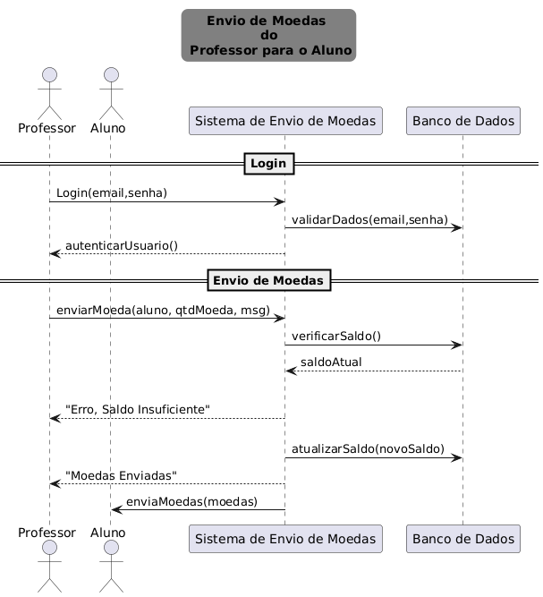

# Sistema de Moeda Estudantil - studentCoin

# Histórias de Usuário

## US 1. Cadastro de Aluno
**Como** aluno,

**Quero** realizar um cadastro no sistema,

**Para que** eu possa participar do sistema de reconhecimento de mérito e acumular moedas.

### Critérios de aceitação.
- Deve ser possível preencher nome, email, CPF, RG, endereço, instituição de ensino e curso.
- As instituições de ensino devem estar pré-cadastradas no sistema e serem selecionadas pelo aluno.

## US 2. Cadastro de Empresa Parceira
**Como** empresa parceira,

**Quero** me cadastrar no sistema,

**Para que** eu possa oferecer vantagens aos alunos e atrair clientes potenciais.

### Critérios de aceitação.
- Deve ser possível cadastrar a empresa com informações como nome, email e vantagens que deseja oferecer.
- Cada vantagem deve ter descrição, custo em moedas e uma foto do produto.

## US 3. Cadastro de Professor
**Como** instituição de ensino,

**Quero** cadastrar os professores do meu corpo docente,

**Para que** eles possam participar da distribuição de moedas aos alunos.

### Critérios de aceitação.
- Cada professor deve ser cadastrado com nome, CPF e departamento vinculado.
- Deve ser associada a informação de que o professor pertence a uma instituição específica.

## US 4. Login e Autenticação
**Como** usuário (aluno, professor ou empresa parceira),

**Quero** acessar o sistema utilizando login e senha,

**Para que** eu possa realizar operações de acordo com meu perfil.

### Critérios de aceitação.
- Deve haver uma tela de login.
- Todos os usuários devem ser autenticados para acessar o sistema.

## US 5. Distribuição de Moedas pelo Professor
**Como** professor,

**Quero** distribuir moedas virtuais para meus alunos,

**Para que** eu possa reconhecer seu bom comportamento e desempenho.

### Critérios de aceitação.
- O professor deve ter um saldo inicial de mil moedas a cada semestre.
- O professor deve indicar o aluno a ser premiado, o montante de moedas e uma mensagem de reconhecimento obrigatória.
- O total de moedas é acumulável de um semestre para o outro.

## US 6. Notificação de Recebimento de Moeda
**Como** aluno,

**Quero** ser notificado por email ao receber uma moeda,

**Para que** eu possa saber quando estou sendo reconhecido.

### Critérios de aceitação.
- Ao receber moedas, o aluno deve ser notificado através do email cadastrado.
- O email deve conter informações sobre o professor que enviou e a mensagem de reconhecimento.

## US 7. Consulta de Extrato de Conta
**Como** aluno ou professor,

**Quero** consultar o extrato da minha conta,

**Para que** eu possa visualizar as transações realizadas e o saldo de moedas.

### Critérios de aceitação.
- O extrato do professor deve mostrar o total de moedas e as transações de envio realizadas.
- O extrato do aluno deve mostrar as moedas recebidas, bem como trocas realizadas.

## US 8. Troca de Moedas por Vantagens
**Como** aluno,

**Quero** trocar minhas moedas acumuladas por vantagens,

**Para que** eu possa usufruir de produtos ou descontos em empresas parceiras.

### Critérios de aceitação.
- O aluno deve selecionar a vantagem desejada e ter o valor descontado do seu saldo de moedas.
- Deve ser enviado um email contendo um cupom com código único para o aluno e para a empresa parceira.
- O email deve incluir o código gerado pelo sistema para facilitar a conferência.

## US 9. Cadastro de Vantagem pela Empresa Parceira
**Como** empresa parceira,

**Quero** cadastrar vantagens no sistema,

**Para que** os alunos possam trocar suas moedas por produtos ou serviços.

### Critérios de aceitação.
- Cada vantagem deve incluir descrição, foto do produto e custo em moedas.
- As vantagens cadastradas devem estar visíveis para os alunos interessados.

## US 10. Envio de Cupom para Troca
**Como** aluno,

**Quero** receber um cupom ao realizar uma troca de moedas por uma vantagem,

**Para que** eu possa utilizá-lo em empresas parceiras.

### Critérios de aceitação.
- O cupom deve ser enviado para o email cadastrado do aluno.
- Um email também deve ser enviado para a empresa parceira contendo o código do cupom.
- O código deve ser único e gerado automaticamente pelo sistema.

---

## Diagrama de Classes 

## Diagrama de Casos de Uso 

## Diagrama Lógico

## Diagrama de Sequencia

